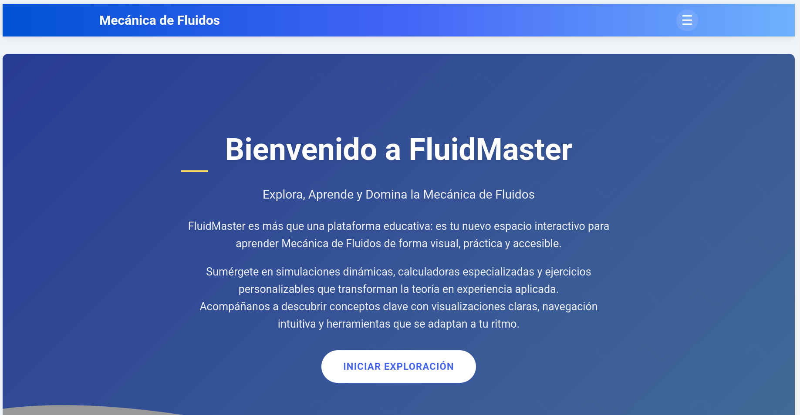

# 🌊 FluidMaster: Plataforma Educativa de Mecánica de Fluidos



## 📋 Descripción

**FluidMaster** es una plataforma web educativa interactiva diseñada para transformar el aprendizaje de la Mecánica de Fluidos. Este proyecto combina teoría sólida con simulaciones dinámicas y calculadoras especializadas, ofreciendo una experiencia de aprendizaje visual, práctica y accesible.

La plataforma permite a los estudiantes explorar conceptos complejos de mecánica de fluidos a través de visualizaciones interactivas, ejercicios personalizables y herramientas de cálculo que convierten la teoría abstracta en experiencia aplicada.

## 🚀 Tecnologías Implementadas

### Frontend
- **HTML5**: Estructura semántica moderna para una mejor accesibilidad y SEO
- **CSS3**: 
  - Diseño responsivo con Grid y Flexbox
  - Animaciones y transiciones para una experiencia de usuario fluida
  - Variables CSS para un sistema de diseño consistente
  - Media queries para adaptabilidad a diferentes dispositivos
- **JavaScript (ES6+)**:
  - Manipulación avanzada del DOM
  - Programación orientada a objetos
  - Manejo de eventos y asincronía
  - Cálculos matemáticos complejos en tiempo real
  - Visualizaciones interactivas

### Bibliotecas y Frameworks
- **Three.js**: Para visualizaciones 3D de fluidos
- **MathJax**: Renderizado de fórmulas matemáticas complejas
- **Math.js**: Cálculos matemáticos avanzados

## 🏗️ Estructura del Proyecto

```
FluidMaster/
├── frontend/
│   ├── css/
│   │   └── style.css
│   ├── js/
│   │   ├── main.js
│   │   ├── menu.js
│   │   ├── presion.js
│   │   ├── tuberias-simulations.js
│   │   ├── tuberias-ejercicios.js
│   │   ├── moody-diagram.js
│   │   └── barcaza-calculator.js
│   ├── images/
│   ├── index.html
│   ├── propiedades.html
│   ├── viscosidad.html
│   ├── presion.html
│   ├── ejercicios.html
│   ├── flotacion.html
│   ├── cinematica.html
│   ├── tuberias.html
│   ├── maquinas.html
│   ├── dimensional.html
│   ├── conversion.html
│   └── simulacion-flujo.html
└── README.md
```

## 📚 Contenido y Secciones

### 1. Introducción
Página principal con una visión general de la plataforma y acceso a todas las secciones.

### 2. Propiedades de los Fluidos
- **Conversión de Unidades**: Calculadora interactiva para conversiones entre diferentes sistemas de unidades.
- **Propiedades**: Explicación detallada de densidad, viscosidad, tensión superficial y otras propiedades fundamentales.
- **Viscosidad en Fluidos**: Simulaciones que muestran el comportamiento de fluidos con diferentes viscosidades.

### 3. Presión e Introducción a la Estática de Fluidos
- **Presión**: Conceptos fundamentales y calculadoras.
- **Ejercicios Interactivos**: Problemas prácticos con soluciones paso a paso.
- **Flotación y Estabilidad**: Simulaciones del principio de Arquímedes y calculadoras de estabilidad de barcazas.

### 4. Cinemática de Fluidos
- **Descripciones Lagrangiana y Euleriana**
- **Patrones de Flujo**
- **Análisis del Movimiento**
- **Ecuación de Continuidad**
- **Ecuación de Bernoulli**: Con simulaciones interactivas y calculadoras.

### 5. Flujo en Tuberías
- **Simulación de Flujo**: Visualizaciones dinámicas de flujo laminar y turbulento.
- **Pérdidas por Fricción**: Calculadora de ecuación de Darcy-Weisbach y diagrama de Moody interactivo.
- **Sistemas de Tuberías**: Simulaciones de sistemas en serie y paralelo.

### 6. Potencia y Eficiencia de Máquinas de Flujo
- **Bombas**: Cálculos de potencia y eficiencia.
- **Turbinas**: Simulaciones y calculadoras.
- **Compresores**: Ejercicios interactivos.

### 7. Análisis Dimensional
- **Teorema Pi de Buckingham**
- **Números Adimensionales**
- **Análisis de Modelos**: Calculadora de análisis dimensional.

## ✨ Características Destacadas

- **Simulaciones Interactivas**: Visualización en tiempo real de fenómenos de fluidos.
- **Calculadoras Especializadas**: Herramientas para resolver problemas específicos de mecánica de fluidos.
- **Diseño Responsivo**: Experiencia óptima en dispositivos móviles, tablets y escritorio.
- **Visualizaciones 3D**: Modelos tridimensionales para mejor comprensión de conceptos complejos.
- **Ejercicios Prácticos**: Problemas interactivos con retroalimentación inmediata.

## 🔧 Instalación y Uso

1. Clona este repositorio:
   ```bash
   git clone https://github.com/tu-usuario/FluidMaster.git
   ```

2. Navega al directorio del proyecto:
   ```bash
   cd FluidMaster
   ```

3. Abre el archivo `frontend/index.html` en tu navegador o usa un servidor local:
   ```bash
   # Con Python
   python -m http.server
   
   # Con Node.js
   npx serve frontend
   ```

## 🎓 Contexto Educativo

Este proyecto fue desarrollado como proyecto final para:
- **Bootcamp Talento Tech: Programación** - Aplicando conocimientos de desarrollo web frontend.
- **Curso de Mecánica de Fluidos** - Implementando conceptos teóricos en aplicaciones prácticas interactivas.

## 👥 Equipo de Desarrollo

- Grupo 4 - Mecánica de Fluidos
